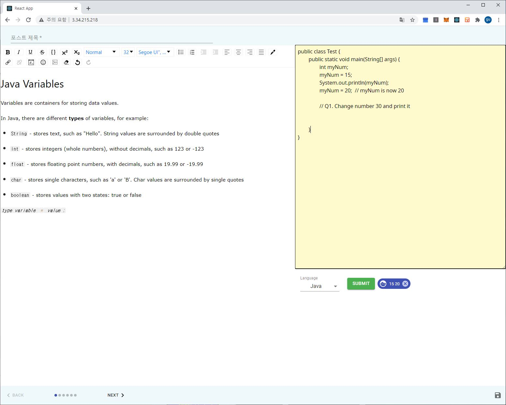
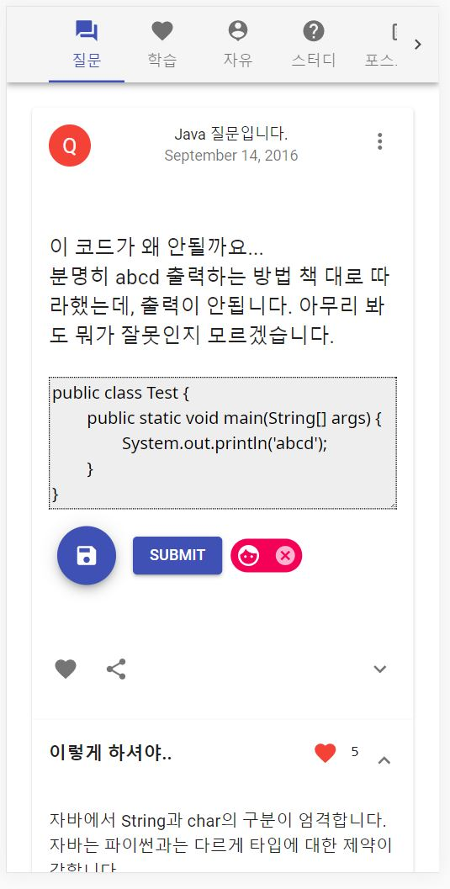

Runable E-book and community
============================

개발자들의 블로그 포스팅이 증가하고 개발의 학습 수요가 증가함에 따라, 개발자들에게 자신만의 실행 및 실습 가능한 E-book 을 발행하는 커뮤니티
아래의 역할을 수행하는 웹 서비스를 제작

1. 코드 실행 및 실습을 진행하는 E-Book의 발행

2. 질문, 게시글에서 직접적인 코드 실행이 가능한 개발자 커뮤니티

사용할 언어 및 DevOps 기술
--------------------------

	javascript
	jenkins(for CI/CD)
	Docker
	Kubernetes
	go language
	python

현재 개발중이고,
현재는 1인 프로젝트로 참여하고 싶으신 분은
wang1@hanyang.ac.kr로 연락주세요

위의 링크에서 현재 개발 상황을 알 수 있습니다.
글 포스트의 경우 모바일은 지원하지 않고,
로그인은 가능하게 열어놨습니다.
개발은 기존에 하는 Detok프로젝트를 마무리 짓고 진행할 예정입니다.

코드 실행 서버는 아래의 repo에 있습니다.
코드 실행 서버는 병렬 프로세싱을 위해 Golanguage로 제작되었으며,
Mutex를 사용하지 않고, Channel과 Channel Channel을 통해
4개의 Worker들이 실행하는 구조로 구현되었습니다.

![Site][https://github.com/javatour/runserver]

